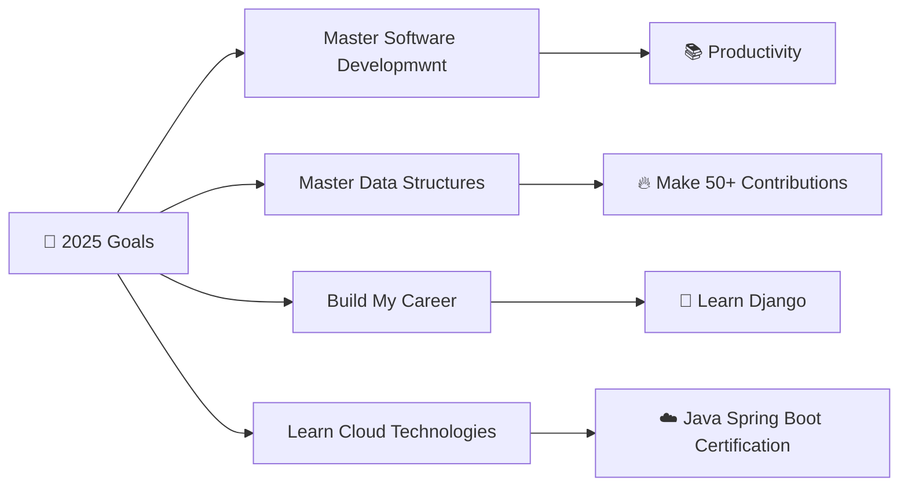

<div align="center">

# 👨‍💻 Abhinav Anil

### `Full Stack Developer` • `Computer Science Student` • `Problem Solver`

[](https://git.io/typing-svg)

</div>

---


### 🚀 **About Me**

```javascript
const abhinav = {
    education: "B.Tech Computer Science & Engineering",
    currentFocus: "Full Stack Development",
    passion: ["Web Development", "Problem Solving", "Open Source"],
    currentlyLearning: ["Advanced React", "System Design", "Cloud Technologies"],
    funFact: "I debug with console.log and I'm proud of it! 😄",
    askMeAbout: ["Web Dev", "Tech", "Coffee ☕"]
};
```

<br clear="right"/>

---

<div align="center">

## 🔥 **Tech Arsenal**

</div>

<div align="center">

### **Frontend Magic** ✨


### **Styling Frameworks** 🎨


### **Backend Power** ⚡


### **Database & Tools** 🛢️


</div>

---

<div align="center">

## 📊 **GitHub Analytics**


</div>

<div align="center">

## 🧠 **LeetCode Journey**

[](https://leetcode.com/06abhinav123)

</div>

---

<div align="center">

## 🌊 **Contribution Graph**

[](https://github.com/abhinavhh/)

</div>

---

<div align="center">

## 🎯 **Current Goals**


```mermaid
graph LR
    A[🎯 2025 Goals] --> B[Master Software Developmwnt]
    A --> C[Master Data Structures]
    A --> D[Build My Career]
    A --> E[Learn Cloud Technologies]
    
    B --> F[📚 Productivity]
    C --> G[🔥 Make 50+ Contributions]
    D --> H[🚀 Learn Django]
    E --> I[☁️ Java Spring Boot Certification]
```

</div>

---

<div align="center">

## 🤝 **Let's Connect & Build Together**

[](https://www.linkedin.com/in/abhinav-u-212b64286)
[](https://instagram.com/_abhi_navhh_)
[](mailto:your.email@gmail.com)
[](https://personal-portfolio-nine-drab.vercel.app/)

</div>

---


<div align="center">

### ✨ **"Code is poetry written in logic"** ✨


**⭐ From [Abhinav Anil](https://github.com/06abhinav123) with 💙**

</div>
