```mermaid
%%{init: {'theme':'dark', 'themeVariables': {'darkMode': true, 'primaryColor': '#58a6ff', 'primaryTextColor': '#c9d1d9', 'primaryBorderColor': '#30363d', 'lineColor': '#58a6ff', 'background': '#0d1117', 'secondaryColor': '#21262d'}}}%%
graph TB
    A[🎯 2025 Goals] --> B[Master System Design]
    A --> C[Advanced Data Structures]
    A --> D[Career Development]
    A --> E[Cloud Technologies]
    
    B --> F[🏗️ Microservices Architecture]
    C --> G[🧠 Algorithm Optimization]
    D --> H[🚀 Senior Developer Role]
    E --> I[☁️ AWS Solutions Architect]
    
    F --> J[📱 Scalable Applications]
    G --> K[🏆 Competitive Programming]
    H --> L[👥 Team Leadership]
    I --> M[🔧 DevOps Integration]
```

<!--
██╗  ██╗██╗
██║  ██║██║
███████║██║
██╔══██║██║
██║  ██║██║
╚═╝  ╚═╝╚═╝
-->

<div align="center">
  
#  Hey there, I'm **Abhinav Anil**

</div>

<div align="center">
  
[](https://git.io/typing-svg)

</div>

<div align="center">
  
```ascii
┌─────────────────────────────────────────────────────────────┐
│                    🚀 Building the Future                   │
│              One Line of Code at a Time                    │
└─────────────────────────────────────────────────────────────┘
```

</div>

<br>


<div align="left">

##  **About Me**

```typescript
const abhinav: Developer = {
  name: "Abhinav Anil",
  role: "Full Stack Developer",
  education: "B.Tech Computer Science & Engineering",
  currentFocus: ["Software Development", "Scalable Applications"],
  passions: ["Web Development", "Problem Solving", "Open Source"],
  currentlyLearning: ["Advanced React Patterns", "MERN", "Django", "Spring Boot", "Angular"],
  askMeAbout: ["Web Development", "Software Architecture", "Tech Trends"],
};
```

</div>

<br clear="right">

---

<div align="center">

##  **Tech Stack**

</div>

<div align="center">

<table>
<tr>
<td align="center" width="50%">

### **Frontend Arsenal** 🎨


</td>
<td align="center" width="50%">

### **Backend Powerhouse** ⚡


</td>
</tr>
<tr>
<td align="center" width="50%">

### **Database & Cloud** 🌐


</td>
<td align="center" width="50%">

### **Development Tools** 🛠️


</td>
</tr>
</table>

</div>

---

<div align="center">

##  **GitHub Analytics**

</div>

<div align="center">
<table>
<tr>
<td width="50%">


</td>
<td width="50%">


</td>
</tr>
</table>
</div>

<div align="center">


</div>

---

<div align="center">

##  **Coding Journey**

</div>

<div align="center">

[](https://leetcode.com/06abhinav123)

</div>

<div align="center">

[](https://github.com/abhinavhh)

</div>

---

<div align="center">

##  **2025 Roadmap**

</div>



---

<div align="center">

##  **Connect & Collaborate**

</div>

<div align="center">

[](https://www.linkedin.com/in/abhinav-u-212b64286)
[](https://instagram.com/_abhi_navhh_)
[](https://personal-portfolio-nine-drab.vercel.app/)
[](mailto:your.email@gmail.com)

</div>

---

<div align="center">

##  **Random Dev Wisdom**


</div>

---

<div align="center">

###  **Support My Work**

[](https://buymeacoffee.com/abhinavanil)
[](https://github.com/sponsors/abhinavhh)

</div>

---

<div align="center">


</div>

---

<div align="center">

### 🌟 **"First, solve the problem. Then, write the code."** 🌟

<table>
<tr>
<td align="center">

</td>
<td align="center">

</td>
<td align="center">

</td>
</tr>
</table>

**✨ Crafted with 💙 by [Abhinav Anil](https://github.com/abhinavhh) ✨**

---

*"Code is not just about syntax, it's about solving problems and creating possibilities."*

</div>
